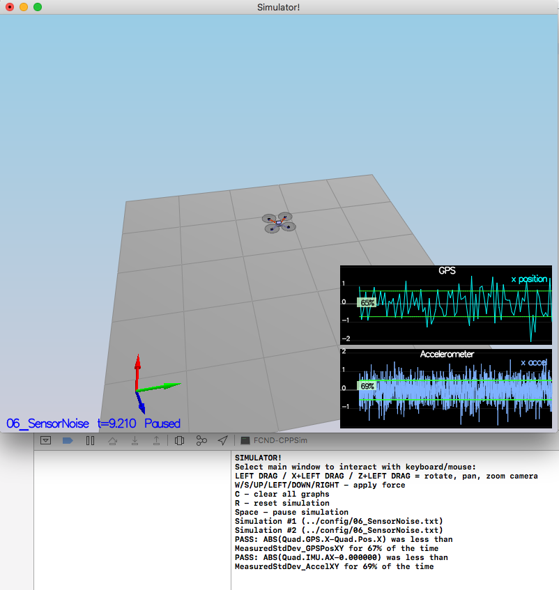
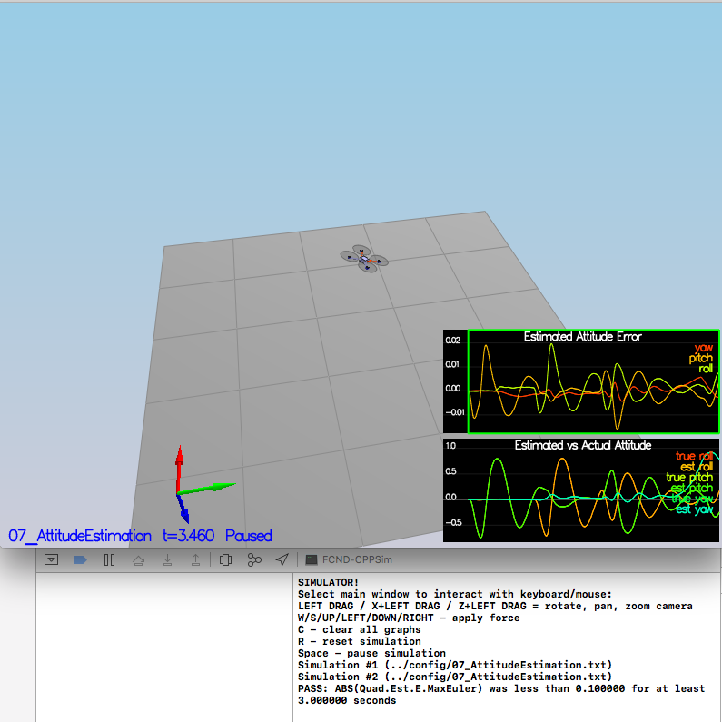
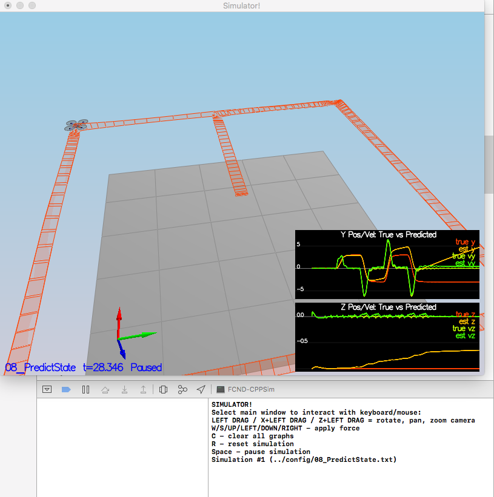
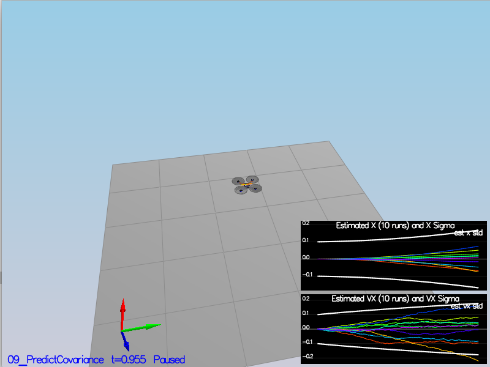
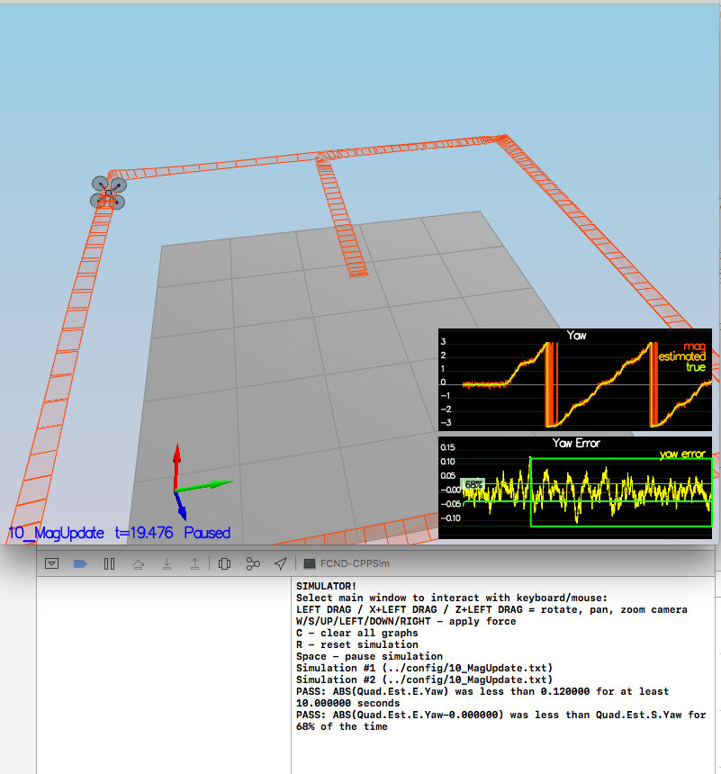
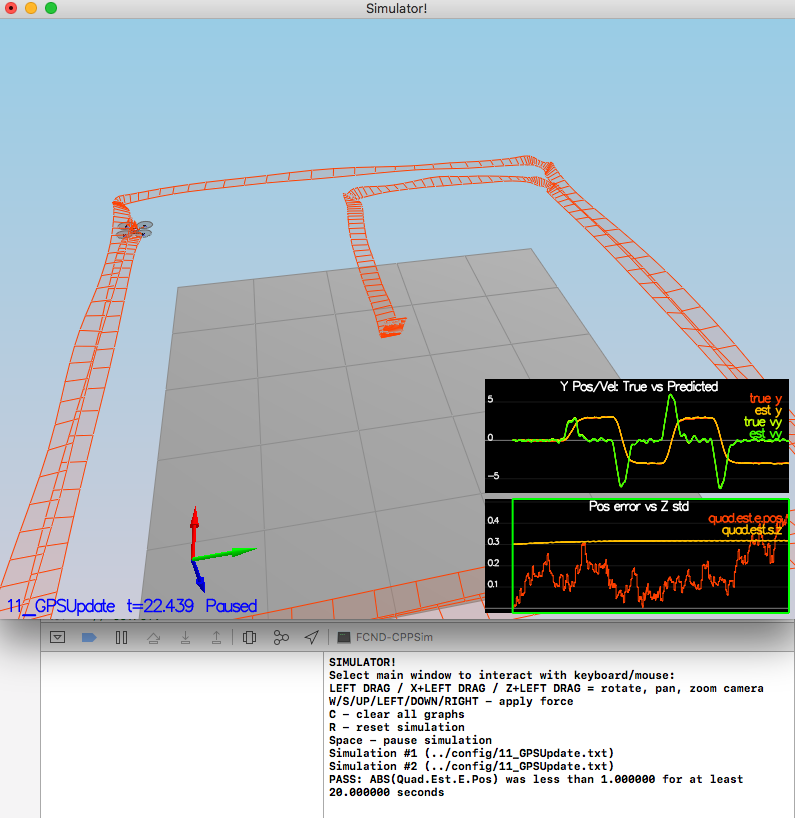

# Estimation Project #

This document is written after completing all steps. Therefore, all
figures shown correspond to scenarios run with the controller I
prepared in the previous project.


### Step 1: Sensor Noise ###


As shown in the figure, the standard deviation values were adjusted to
approximately capture 68% of the respective measurements. 



The standard deviation can be obtained as the square root of the
sample variance of the entries of the second column in the data files. 

### Step 2: Attitude Estimation ###


The complementary filter in  `UpdateFromIMU()` was implemented. The
tricky part was to write the integration in terms of the quaternions:


```
    Quaternion<float> qt = Quaternion<float>::FromEuler123_RPY(rollEst,pitchEst,ekfState(6));
    Quaternion<float> predicted = qt.IntegrateBodyRate(gyro,dtIMU);
    predictedRoll = predicted.Roll();
    predictedPitch = predicted.Pitch();
    ekfState(6) = predicted.Yaw();

```

As shown in the figure, the tests are successfully passed.




### Step 3: Prediction Step ###

The prediction step has been implemented successfully. As shown in the
figure, the estimator state tracks the actual state with only
reasonably slow drift.
 



Next, the partial derivative of the body-to-global rotation matrix was
implemented, as well as the rest of the prediction step. The parameters
 `QPosXYStd` and `QVelXYStd` where tuned to capture the magnitude of
 the error, as shown next.
 
  
 

### Step 4: Magnetometer Update ###


The parameter `QYawStd` (`QuadEstimatorEKF.txt`) was tuned to
approximately capture the magnitude of the drift.

The magnetometer update has been successfully implemented in
`UpdateFromMag()`. The tests are passed as shown next:


  


### Step 5: Closed Loop + GPS Update ###


The flag `Quad.UseIdealEstimator` was set to 0  and the lines
```
#SimIMU.AccelStd = 0,0,0
#SimIMU.GyroStd = 0,0,0
```
commented out. 

The EKF GPS Update was implemented next. The test is passed, as seen next:

  


### Step 6: Adding Your Controller ###

When I used my controller, the attitude of the drone was changing
slightly erratically, but I just had to decrease the gains of the body
rate controller; the rest of parameters were not modified. The results
of the test are shown in the previous figure. 
